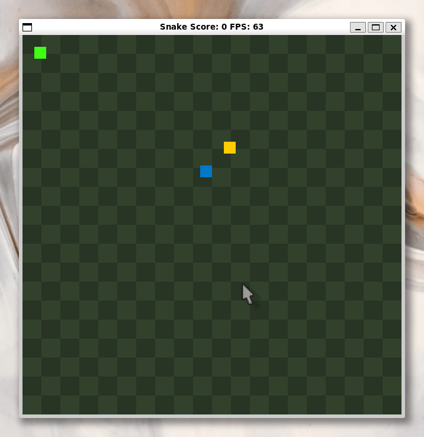

# CPPND: Capstone Snake Game Example

This is a submission for the Capstone project in the [Udacity C++ Nanodegree Program](https://www.udacity.com/course/c-plus-plus-nanodegree--nd213). 
The code for this repo, and the base Snake game implementation, was inspired by [this](https://codereview.stackexchange.com/questions/212296/snake-game-in-c-with-sdl) excellent StackOverflow post and set of responses.

The completed submission looks like the following.

## Dependencies for Running Locally
* cmake >= 3.7
  * All OSes: [click here for installation instructions](https://cmake.org/install/)
* make >= 4.1 (Linux, Mac), 3.81 (Windows)
  * Linux: make is installed by default on most Linux distros
  * Mac: [install Xcode command line tools to get make](https://developer.apple.com/xcode/features/)
  * Windows: [Click here for installation instructions](http://gnuwin32.sourceforge.net/packages/make.htm)
* SDL2 >= 2.0
  * All installation instructions can be found [here](https://wiki.libsdl.org/Installation)
  >Note that for Linux, an `apt` or `apt-get` installation is preferred to building from source. 
* gcc/g++ >= 5.4
  * Linux: gcc / g++ is installed by default on most Linux distros
  * Mac: same deal as make - [install Xcode command line tools](https://developer.apple.com/xcode/features/)
  * Windows: recommend using [MinGW](http://www.mingw.org/)

## Basic Build Instructions

1. Clone this repo.
2. Make a build directory in the top level directory: `mkdir build && cd build`
3. Compile: `cmake .. && make`
4. Run it: `./SnakeGame`.

## CC Attribution-ShareAlike 4.0 International

Shield: [![CC BY-SA 4.0][cc-by-sa-shield]][cc-by-sa]

This work is licensed under a
[Creative Commons Attribution-ShareAlike 4.0 International License][cc-by-sa].

[![CC BY-SA 4.0][cc-by-sa-image]][cc-by-sa]

[cc-by-sa]: http://creativecommons.org/licenses/by-sa/4.0/
[cc-by-sa-image]: https://licensebuttons.net/l/by-sa/4.0/88x31.png
[cc-by-sa-shield]: https://img.shields.io/badge/License-CC%20BY--SA%204.0-lightgrey.svg

# Features added

## Poison
A new poisoned food type was added to the game. This introduces a new loss condition - when the snake ingests too much poison. Eating the poisoned food also decreases the player's score by 1. However, it does not reduce the length of the snake or decrease the speed of the snake - this means that more skill is required to reach the highest score. 

## Checkered background
The background has been changed to a checkered pattern instead of the a plain black background. 
I made this change to make it easier for the player to determine when the snake is in the same row or column as the food. I found the early part of the original game frustrating, it was difficult to line up the snake with the food from a long distance when the food was not close to the edges. Adding this geometric pattern makes it easier to line up the snake.
The coloured backround also makes the game more visually appealing. 

# Rubric
## Loops, Functions, I/O
### The project demonstrates an understanding of C++ functions and control structures
The implementation of the checkered pattern demonstrates the understanding of c++ functions and control structures in a few different ways.
* An understanding of functions is demonstrated in the introduction of the two new functions `InitGrid` and `RenderGrid`. These functions can be found on lines 44 and 106 of renderer.cpp. The `InitGrid` function was created to perform the, one-time-only, work of caching the co-ordinates of the rectangles that are rendered to create the checkered pattern background. The `RenderGrid` function encapsulates the logic of looping over the rectangles' co-ordinates, alternating the colors and rendering the rectangles on the background, each loop of the game engine.
* An understanding of c++'s control structures is demonstrated in the two new functions `InitGrid` and `RenderGrid`. The `InitGrid` function uses a nested **for loop** to enumerate the co-ordinates of the rectangles that will be rendered to the screen, and store them in an array. This code can be found on lines 49 - 56 of renderer.cpp. The `RenderGrid` function uses both a **for loop** and an **if-else statement** to implement the logic required to render the correctly colored rectangle to the screen. This code can be found on lines 110 - 119 of renderer.cpp.
### The project uses data structures and immutable variables. 
The implementation of the checkered pattern demonstrates the use of arrays and constant values.
* The `grid_rectangles` and `total_num_rect_in_grid` variables are constants defined in renderer.h. The `total_num_rect_in_grid` variable holds the calculated number of rectangles needed to form the checkered pattern of the background; which is used to initialize the `grid_rectangles` array. The `total_num_rect_in_grid` variable is set as part of the `Renderer` constructor's member initialization list in renderer.cpp, on line 10. The `grid_rectangles` array is populated in the `Renderer` constructor when the `InitGrid` function is called on line 35 in renderer.cpp.
* The newly introduced classes `Food` (declared in food.h), `Poison` (declared in poison.h), and `Location` (declared in location.h) are all immutable.
### The project accepts user input and processes the input.
* Whilst the game is running, the escape key can be pressed to quit the game. The user input handler (`Controller` defined in controller.h) has been refactored. As part of the refactoring, an enum `UserInput` was introduced to define the possible input options - including a new `quit` type. The implementation of the `HandleInput` function (found in the controller.cpp file) was modified to detect when the escape key has been pressed by the player.
## Object Oriented Programming
### One or more classes are added to the project with appropriate access specifiers for class members.
* The abstract class `Interactable` has been added (found in interactable.h). Two implementations of the `Interactable` interface have been added - `Food` (declared in food.h) and `Poison` (declared in poison.h). The `Location` class has also been added to store the co-ordinates of derrived, `Interactable` classes. 
### Class constructors utilize member initialization lists
* The abstract class `Interactable` provides two constructors that utilize member initialization lists. The `Food` and `Poison` classes also define, two convinience constructors that utilize member initialization lists.
* The `Location` class also utilizes member initialization lists.
### Classes abstract implementation details from their interfaces.
All of the classes in the project have been designed this way, the most interesting examples are in the more complex classes.
* The `Renderer` class (defined in render.h and implemented in render.cpp) has been updated to include two new functions `InitGrid` and `RenderGrid`. The definition of the functions' interfaces does not how what data type is used to store the data or how the logic is implemented. The names of the functions are pretty self explanatory.
* The `Snake` class has been updated to include two new functions - `IsOpositeDirection` and `HandleInput` (defined in snake.h and implemented in snake.cpp from lines 96 - 144). The logic was refactored out of the `Controller` class and into the `Snake` class in order to decouple the two classes. 
### Classes follow an appropriate inheritance hierarchy with virtual and override functions.
* The `Interactable` abstract class in `Food` and `Poison` derrived classes demonstrate the behavior of following an appropriate inheritance hierarchy with virtual and override functions. The `GetType` function is a virtual function of the `Interactable` abstract class and overridden in the derrived classes. 
### Templates generalize functions or classes in the project.
* A template `PlaceInteractable` has been introduced to generalize the logic for placing an interactable item (e.g. food or poison). The implementation of this template can be found in game.h lines 43 - 56. 
* The `Location` class has a template to provide an implementation of a hashing function for the type - based on the logic [in the std::hash documentation](https://en.cppreference.com/w/cpp/utility/hash). The implementation of this template can be found in location.h lines 17 - 25.
## Memory Management
### The project makes use of references in function declarations.
* The `Snake` classes updated `Update` function uses pass-by-reference for the `std::mutex` and `std::conditional_variable` function arguments. The `std::mutex` can not be copied, and it wouldn't make sense to create a copy of the `std::conditional_variable` argument since the thread is waiting on notify to be called (to inform the snake that a new frame is being created). The updated code can be found on line 6 of snake.cpp.
* The `Game` classes newly introduced `IsLocationOccupied` function uses pass-by-reference to avoid copying the `Location` function argument. This addition can be found on line 114 of game.cpp.
### The project uses destructors appropriately.
* The `Renderer` class' destructor has been updated to delete the dynamically, heap allocated array `grid_rectangles`. This addition can be found on line 41 of renderer.cpp.
### The project uses scope / Resource Acquisition Is Initialization (RAII) where appropriate.
Variables have been scoped as locally as possible througout the project and RAII-compliant standard classes have been leveraged.
* For example, the `latest_input` variable of type `std::shared_ptr` is scoped to within the `Game`'s `Run` function (found on line 25 of game.cpp). This makes sure that the user's input can be communicated between classes through a pointer, and the destructor is called when the `Run` function terminates. 
* Another example, is the `lastTickLock` variable of type `std::unique_lock`. This is also scoped to within the `Game`'s `Run` function (found on line 29 of game.cpp). This makes sure that the lock associated with the class' mutex is unlocked when the `Run` function terminates. 
### The project uses smart pointers instead of raw pointers.
The project makes use of `std::shared_ptr`s to share data between classes and threads. 
* The data associated with the `Snake` instance is required both in the `Game` and `Renderer` classes. A `std::shared_ptr` is used pass a pointer to the `Snake` instance to the `Renderer` class.
* The `Snake` class needs to check what the most recent user input was each frame, and to also check when the last frame occurred to guard against spurious wakeups. This is accomplished using `std::shared_ptr`s to the `Game`-owned `last_tick` and `latest_input` variables. The code for the `Snake`'s input function can be found on lines 6 - 35 of snake.cpp.
* The `Game`'s map of object locations (`objects` - see line 24 of game.cpp) is needed in both the `Game` and `Renderer` classes. A `std::shared_ptr` is used pass a pointer to the instance `std::unorded_map` to the `Renderer` class. This make sure that the game's view of the world state is being displayed correctly without copying the map or data structures. The design also allows for there to be more objects in the game world in a memory efficient way.